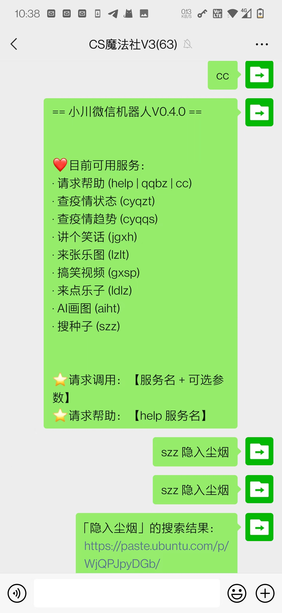

# 南川微信机器人服务

## intro

本项目提供基于微信平台的机器人服务，目前已实现：

- [x] 新冠疫情
  - [x] 支持发送`查疫情状态 + 省市`触发回复该省市查询累计与当日的疫情数据
  - [x] 支持发送`查疫情趋势 + 省市`触发回复按省市查询历史新增疫情数据然后生成的图表
- [x] 糗事百科
  - [x] 支持发送`讲个笑话`触发回复糗事百科纯文本
  - [x] 支持发送`来张乐图`触发回复糗事百科纯图文
  - [x] 支持发送`搞笑视频`触发回复糗事百科视频
  - [x] 支持发送`来点乐子`触发随机执行上述三者之一
- [x] AI画图
  - [x] 支持发送`AI画图 + 文本`触发回复基于Dalle-mini模型生成的九张图片之一
- [x] 搜种子
  - [x] 支持发送`搜种子 + 文本`触发回复基于btdig.com搜索种子的第一页结果在ubuntu paste里的链接
- [ ] ……



## environment token

- 基于`wechaty`框架
- 基于`padlocal`协议（需要自己申请一个token，然后仿照`.env.sample`写在`.env`里）

## pre-run (Ubuntu as an example)

### 1. install `yarn`

```shell
sudo apt remove cmdtest
sudo apt remove yarn
curl -sS https://dl.yarnpkg.com/debian/pubkey.gpg | sudo apt-key add -
echo "deb https://dl.yarnpkg.com/debian/ stable main" | sudo tee /etc/apt/sources.list.d/yarn.list
sudo apt-get update
sudo apt-get install yarn -y
```

### 2. install packages for `canvas`

```shell
# otherwise can't `yarn`
# ref: https://stackoverflow.com/a/64567740/9422455
sudo apt-get install build-essential libcairo2-dev libpango1.0-dev libjpeg-dev libgif-dev librsvg2-dev

# otherwise can't draw Chinese
# ref: https://gist.github.com/wohugb/120f59d024e74532b639
sudo apt-get install language-pack-gnome-zh-hans fonts-wqy-microhei
```

### 3. init project

```shell
yarn
```

### 4. install `ts-node`

```shell
# install node with the latest version (>=12 necessary)
curl -fsSL https://deb.nodesource.com/setup_current.x | sudo -E bash -
sudo apt-get install -y nodejs

# install npm
sudo apt install npm

# install ts-node
npm i -g ts-node
```

### run

```shell
ts-node src/wechaty/bot.ts
```

## service: 新冠疫情查询

- 数据源：https://news.qq.com/zt2020/page/feiyan.htm#/area?adcode=530600
- 数据主要接口：https://api.inews.qq.com/newsqa/v1/query/inner/publish/modules/list?modules=diseaseh5Shelf

## service: 来点乐子

以下是一些尽调，但都不是很满意，最后用的是 app端的糗事百科，体验尚可。

- free-api.com
  - desc
    - 这是一个提供众多api的网站（包括笑话），需要token
  - ref
    - home: https://www.free-api.com/
- 讲个笑话API 
  - desc
    - 直接调用api，就能返回纯文字结果（含`\n`），但有点小小低俗
  - ref
    - doc: https://api.lklblog.cn/index/ss?id=1
    - api: https://api.lklblog.cn/api/qwxh.php

## nodejs生成图表框架选型

- chart.js [√]
  - install: `yarn add chart.js chartjs-node-canvas` 
  - pros
    - 纯 node，不需要启动额外的服务
    - 基于 canvas，可以无缝对接 MDN 有很好的定制性
  - ref
    - doc: https://www.chartjs.org/docs/latest/charts/line.html
    - how to smooth via `tension`: https://www.appsloveworld.com/chart-js-how-to-make-sharp-lines-to-smooth-curved-lines
- image-charts [x]
  - install: `yarn add image-charts`
  - pros
    - 接口非常简练，较为友好
    - 有较为详细的文档与playground
  - cons
    - 不支持曲线图（不可接受）
  - ref
    - repo: https://github.com/image-charts/javascript
    - doc: https://documentation.image-charts.com/line-charts/
    - playground: https://editor.image-charts.com/
- puppet [x]
  - install: `yarn add puppeteer`
  - pros
    - 基于chromium非常强大
    - 自带了曲线
    - 图像生成效果好、优美
  - cons
    - 需要不断启动与关闭chromium，或者主动维护，以及程序代码不够干净（不可接受）
    - 需要额外安装chromium（~200Mb)
  - ref
    - doc: https://pptr.dev/
    -** 

## service: 搜种子

### btdig.com 需要基于 tslv1.2

首先必须要能翻墙，也就是基于 vpn 。

> 我aws香港的服务器本身就能翻墙，但即使基于 `tslv1.2` ，还是反馈 `429 Too Many Requests`的错误，目前该服务器也是通过 vpn 翻墙从而确保 btdig.com 访问正常的；但在 mac 上就比较方便，连参数都不用加，可能是因为 mac 用的是 `libreSSL` 比较智能的原因。

其次必须要使用基于 `tslv1.2` 的协议。

#### curl命令

```shell
curl https://btdig.com/search\?order\=0\&q\=%E5%8F%98%E5%BD%A2%E9%87%91%E5%88%9A -H 'user-agent:Mozilla/5.0 (X11; Ubuntu; Linux i686; rv:24.0) Gecko/20100101 Firefox/24.0' \
--verbose --tslv1.2 --tsl-max 1.2
```

#### nodejs 中基于 `https`

```typescript
  {
    secureProtocol: "TLSv1_2_method",
    agent: new HttpsProxyAgent({
      host: 'localhost',
      port: 7890,
    }),
  }
```

#### nodejs 中基于 `tunnel-agent`

```typescript
  httpsAgent: TunnelAgent.httpsOverHttp({
    proxy: {
      host: 'localhost',
      port: 7890,
    },
    maxVersion: "TLSv1.2",
    minVersion: "TLSv1.2",
  }),
  proxy: false,
```